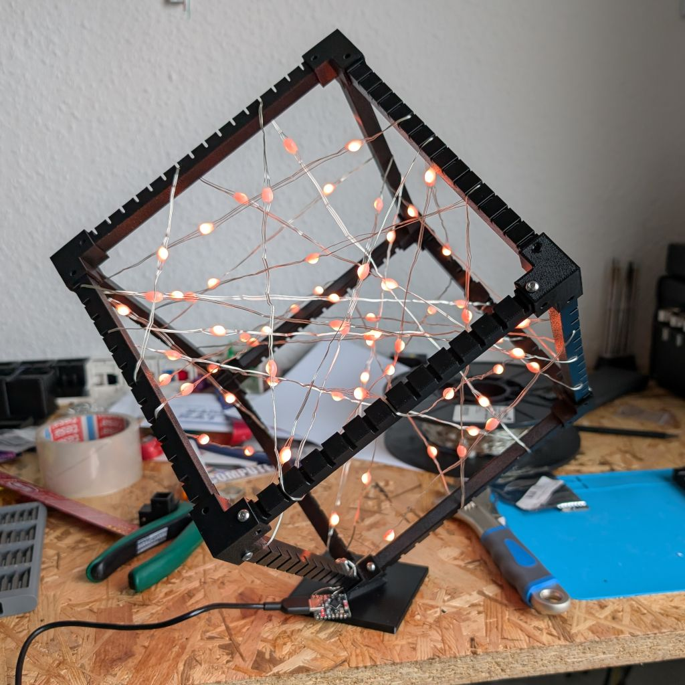

# Minikube - LED Cube Prototype

A smaller ~20×20×20cm prototype version of the main 1m LED cube, perfect for testing animations and learning the concepts without building the full installation.

## Overview

The minikube is a fully self-contained LED cube made entirely from 3D printed parts, M3 screws, a single WS2812B LED strand, and a MicroPython-compatible microcontroller. It runs standalone without requiring a Raspberry Pi or custom PCB, making it an excellent starting point for experimentation.

## Features

- **Standalone operation:** Runs animations directly on ESP32-C3 with MicroPython
- **Fully 3D printed:** No carbon fiber tubes or specialized parts needed
- **Low cost:** Uses readily available components
- **Self-contained:** All animation code runs on the microcontroller
- **Easy to build:** Simpler assembly than the main cube
- **Portable:** Small size makes it easy to transport and demo

## Bill of Materials

### Electronics

- **Microcontroller:** ESP32-C3 development board ([AliExpress link](https://de.aliexpress.com/item/1005007205044247.html))
  - Any ESP32 variant that supports MicroPython and WS2812 control will work
  - Recommended: 4MB flash or more

- **LED Strip:** WS2812B addressable LED string ([AliExpress link](https://de.aliexpress.com/item/1005001915144430.html))
  - 10m string with 10 LEDs per meter (100 LEDs in total) is sufficient

- **Power Supply:** Any USB supply to power the ESP and LED string

- **Optional:** 3.3V to 5V level shifter for data line
  - A small PCB with 4× WS2812 LEDs works well for this purpose ([AliExpress link](https://de.aliexpress.com/item/1005010216258357.html))
  - Not strictly necessary but improves signal integrity

### Mechanical

- **M3 screws:** 24× M3 screws, approximately 8mm length
- **3D printed parts:** See [mechanical/README.md](mechanical/README.md)
  - 12× Stick parts
  - 7× Corner parts
  - 1× Base part

### Tools

- 3D printer with PLA or PETG filament
- Soldering iron and solder
- Wire strippers
- Screwdriver
- Electrical tape or zip-ties
- Computer with USB for programming

## Project Structure

- **`firmware/`** - MicroPython code that runs on the ESP32-C3. See [firmware/README.md](firmware/README.md) for installation instructions, wiring, usage, and animation development.

- **`mechanical/`** - 3D printable parts and assembly instructions. See [mechanical/README.md](mechanical/README.md) for part specifications, printing guidelines, and assembly steps.

## Getting Started

1. **Build the physical cube:** Follow the instructions in [mechanical/README.md](mechanical/README.md) to print parts and assemble the structure.

2. **Install firmware and wire electronics:** Follow the instructions in [firmware/README.md](firmware/README.md) to flash MicroPython, wire the electronics, and upload the firmware.

3. **Calibrate LED positions:** Use the calibration tools in `../calibration/` to map the 3D coordinates of each LED for accurate volumetric rendering.
